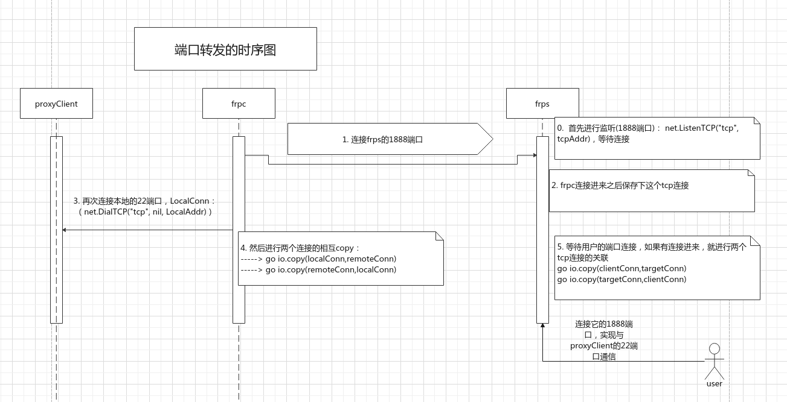

# 前言

最近有时间想深入学习下golang，正好又遇到一些场景需要用到内网穿透。于是找到frp，然后就分析分析它的源码吧。


# 代码的基本分析方法

首先把frp 0.1.0的代码拉下来，为啥需要0.1.0的代码呢？因为0.1.0的代码往往是最简单的，先分析简单的，对新手来说比较友好。

0.1.0的代码看起来还是比较复杂了，对于新手来说还是不太友好。我们要做的就是把复杂的东西简单话，提取代码的核心逻辑，这样才能不被复杂的逻辑绕晕。


## 第一步:需求分析

要分析源代码首先需要知道它的主要功能是什么，是为了解决什么问题。frp的主要功能是代理转发，把内网端口转发到具有公网IP的主机上，以达到通过访问该公网IP的主机访问到内网主机服务的目的。（听起来还是有点抽象对吧？）没关系，举个最简单的例子：

把内网的ssh端口转发出来，让任何主机都能够访问。（这个就是非常明确并且足够简单的需求了吧?）

把需求搞清楚了之后问题其实已经解决一半了。


## 第二步：画图

根据需要，首先画出最最简陋的流程图，并用代码实现它. 为了最大程度降低代码复杂度，这个流程图只保留了最核心的功能 。




## 第三步：编码

用最简单的代码实现最核心的功能， 之后再逐步完善。

代码见github, 其核心功能就是io.Copy()这个函数,

关于这个函数的更多用法这个地方就不解释了, 想了解的直接google


## 第四步: 运行看结果

```
#首先在本地运行 frps
./frps

#然后运行 frpc
./frpc


#最后ssh连接本地的1888端口
ssh root@127.0.0.1 -p1888

#这样就可以看到本机的22端口成功转发到了1888端口

```

这个就是frp 0.1.0的代码简化版的核心功能了,其他的代码无非就是让这个核心的代码能够稳定有序的执行. 后面我们会在这个代码的基础上逐步继续完善. 
